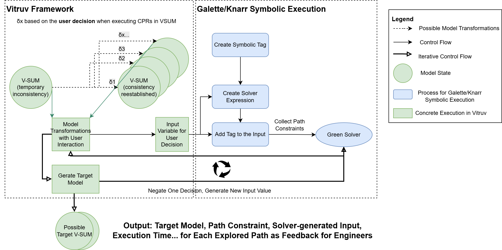

# CocoPath-Concolic Exploration of Consistency-Preserving Paths

## Overview

This project integrates **Galette** (dynamic taint tracking for JVM), **Knarr** (symbolic execution engine), **GreenSolver** (constraint solver), and **Vitruvius** (model transformation framework) to enable automatic path exploration in model-driven engineering workflows.

This framework provides **concolic execution** (combined concrete + symbolic execution) for model transformations. It automatically:

1. **Executes transformations** with concrete input values
2. **Tracks symbolic values** through the transformation logic
3. **Collects path constraints** at decision points (if/switch statements)
4. **Generates new inputs** by negating constraints
5. **Explores all paths** automatically until complete



### Key Components

#### Galette
- **Purpose**: Dynamic taint tracking for JVM bytecode
- **Role**: Attaches symbolic "tags" to values and propagates them through operations
- **Location**: `galette-agent/`, `galette-instrument/`
- **Key APIs**: `Tainter.setTag()`, `Tainter.getTag()`

#### Knarr
- **Purpose**: Symbolic execution engine built on Galette
- **Role**: Creates symbolic values and tracks path constraints
- **Location**: `knarr-runtime/src/main/java/edu/neu/ccs/prl/galette/concolic/knarr/runtime/`
- **Key Classes**:
  - `GaletteSymbolicator` - Creates symbolic values
  - `PathUtils` - Collects path conditions
  - `PathExplorer` - Automatic path exploration API
  - `ConstraintSolver` - Negates and solves constraints

#### GreenSolver
- **Purpose**: Constraint solving using Z3/CVC/other SMT solvers
- **Role**: Solves path constraints to generate new test inputs
- **Integration**: Used by `ConstraintSolver` to find satisfying assignments
- **Dependency**: `za.ac.sun.cs:green` (Maven)

#### Vitruvius Framework
- **Purpose**: Consistency preservation for model transformations
- **Role**: Provides real-world model transformation scenarios
- **Example**: Amalthea ↔ ASCET model synchronization
- **Location**: `amalthea-acset-integration/`

## Project Structure

```
knarr-runtime/
├── src/main/java/
│   └── edu/neu/ccs/prl/galette/
│       ├── concolic/knarr/runtime/
│       │   ├── GaletteSymbolicator.java      # Creates symbolic values
│       │   ├── PathUtils.java                # Collects path constraints
│       │   ├── PathExplorer.java             # Automatic path exploration
│       │   └── ConstraintSolver.java         # Constraint negation & solving
│       └── vitruvius/
│           └── AutomaticVitruvPathExploration.java      # Automatic path exploration
├── src/test/java/                            # Unit tests
├── run-symbolic-execution.sh/.bat/.ps1       # Execution scripts
└── README.md                                 # This file

amalthea-acset-integration/                    # Vitruvius example
├── vsum/src/main/java/.../Test.java          # Model transformation entry point
└── consistency/src/main/reactions/           # Transformation reactions
```

## Running the Project

### Prerequisites

1. **Java 17** 
2. **Maven 3.6+**

### Quick Start

```bash
cd knarr-runtime

# Interactive mode (choose internal or external)
./run-symbolic-execution.sh

# Or specify directly:
./run-symbolic-execution.sh --internal   # Fast, simplified
./run-symbolic-execution.sh --external   # Full Vitruvius transformations
```

**Windows:**
```cmd
run-symbolic-execution.bat
```

**PowerShell:**
```powershell
.\run-symbolic-execution.ps1
```

### Execution Modes

#### Internal Mode (Default)
- **Output**: Simplified XMI stubs
- **Requirements**: None (self-contained)
- **Use case**: Quick testing, demonstration

#### External Mode
- **Output**: Full Vitruvius reactions & transformations
- **Requirements**: External Amalthea-acset repository: https://github.com/IngridJiang/Amalthea-acset
- **Use case**: Real-world model transformation scenarios

### Output Files

After execution, you'll find:

```
knarr-runtime/
├── execution_paths_automatic.json    # Path exploration results (JSON)
└── galette-output-automatic-*/       # Generated models per path
```

## Testing

```bash
# Run all tests
mvn test

# Run specific test
mvn test -Dtest=ConstraintSolverTest

# Run with debug output
mvn test -Dpath.explorer.debug=true -Dconstraint.solver.debug=true
```

## Debug Flags

Set these system properties for verbose output:

```bash
-Dpath.explorer.debug=true           # PathExplorer debug output
-Dconstraint.solver.debug=true       # ConstraintSolver debug output
-Dsymbolic.execution.debug=true      # GaletteSymbolicator debug output
-Dpath.explorer.max.iterations=100   # Max exploration iterations (default: 100)
```

## Example: Vitruvius Model Transformation

The `AutomaticVitruvPathExploration` demonstrates automatic exploration of a **consistency-preserving model transformation** between two models:

- **Source model (Amalthea)**: captures tasks and their execution behavior in an automotive ECU timing model.
- **Target model (ASCET)**: represents the corresponding software architecture and implementation-oriented entities (e.g., ASCET tasks).

Vitruvius ensures **consistency preservation** between these two models by using *CPRs / *reactions*:  
whenever the Amalthea model is changed (e.g., a new task is created or its type is modified), the corresponding ASCET elements are created or updated so that both views remain consistent.

CocoPath augments this with **concolic path exploration**:

- User decisions (e.g., which task type to create) are treated as **symbolic inputs**.
- For each decision path, CocoPath triggers the Vitruvius reactions and records:
  - the resulting consistent pair *(Amalthea model, ASCET model)*,
  - the **path constraint** describing the corresponding user decisions, and
  - the **solver-generated concrete input** that realizes this path.

This allows engineers to **systematically explore alternative consistency-preserving evolution paths** of the V-SUM.

For each path, CocoPath stores:

- the **resulting Amalthea model** (with the chosen task configuration),
- the **synchronized ASCET model** produced by Vitruvius,
- the **path condition** 
- and execution time


## License

See [LICENSE](../LICENSE) in the project root for Galette.

## Acknowledgements

- **Galette**: PRL Lab at Northeastern University
- **GreenSolver**: STAR Lab at University of Stellenbosch
- **Vitruvius**: KIT (Karlsruhe Institute of Technology)
- **Amalthea-ASCET**: Automotive model transformation Example from Bosch